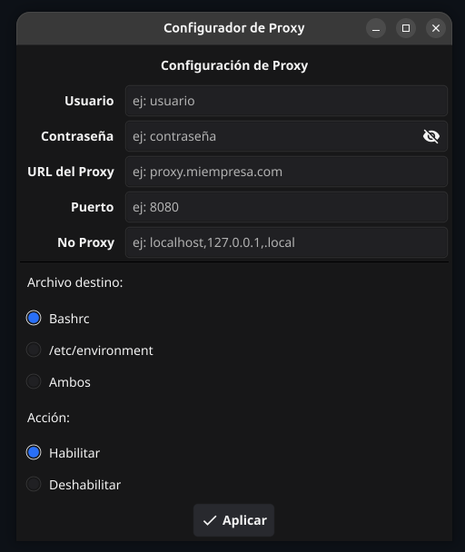

# Proxy Manager

Aplicación GUI escrita en Go con [Fyne](https://fyne.io/) para configurar el proxy del sistema en archivos de entorno como `/etc/environment` y `~/.bashrc`.

## Funcionalidad

- Formulario para ingresar credenciales de proxy (usuario, contraseña, URL, puerto, no_proxy).
- Selección de archivo destino: `~/.bashrc`, `/etc/environment` o ambos.
- Habilitar o deshabilitar el proxy.
- Solicita permisos de administrador via `pkexec` cuando se modifica `/etc/environment`.

## Captura



## Uso

```bash
go build .
./proxy-manager
```

## Requisitos

- Go 1.26+
- [Fyne](https://fyne.io/) y sus dependencias del sistema
- `pkexec` (parte de PolicyKit) para escritura en `/etc/environment`
